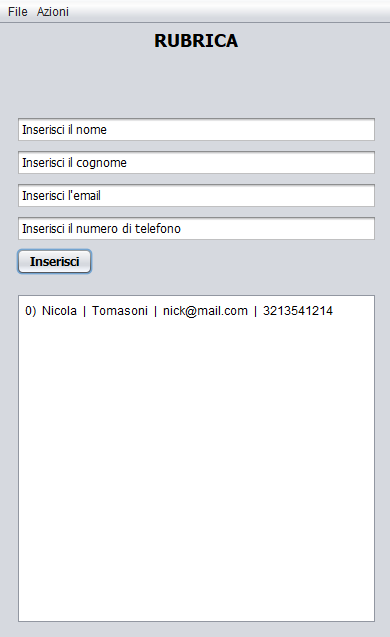
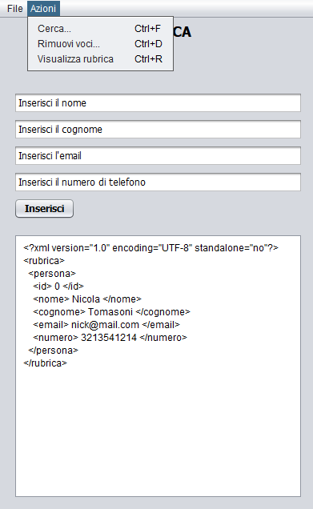

# Simple Address Book
This Java Swing application provides a basic address book functionality, allowing users to add, view, search, and remove contacts. The contacts are stored and managed in an XML format.

## Table of Contents
- [Features](#features)
- [Technologies Used](#technologies-used)
- [Java Concepts and Features](#java-concepts-and-features)
- [Screenshots](#screenshots)

## Features
- Add New Contacts: Easily input and save new contact details (name, surname, email, phone number).
- View Contacts: Display all stored contacts in a user-friendly format or as their raw XML representation.
- Search Contacts: Find specific contacts by searching through their details.
- Remove Contacts: Delete existing contacts from the address book.
- Save/Load Address Books: Save the current address book to an XML file and import existing XML address book files.
- Automatic Folder Creation: Upon first launch, the application creates a **Address Book** folder on your desktop to store XML files.
- Basic Input Validation: Checks for empty fields and validates phone number format.
- Documentation Access: Open a local **documentation.txt** file (if present) for application details.

## Technologies Used
Java Swing: For the graphical user interface.
DOM Parser: To create, parse, and manipulate XML documents.
XSLT (via Transformer API): For transforming XML data into a readable string format for display.

## Java Concepts and Features
- String Manipulation
- Date Handling and Formatting
- File I/O
- Input Validation
- Event Handling
- Exception Handling (try/catch)
- XML File Parsing/Import
- XML DOM Manipulation
- XML Transformation (XSLT)
- Static UI (Swing)
- User Notification Dialogs

## Screenshots

